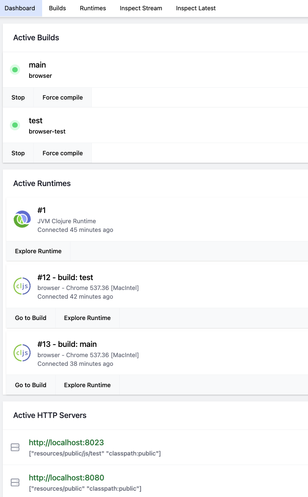
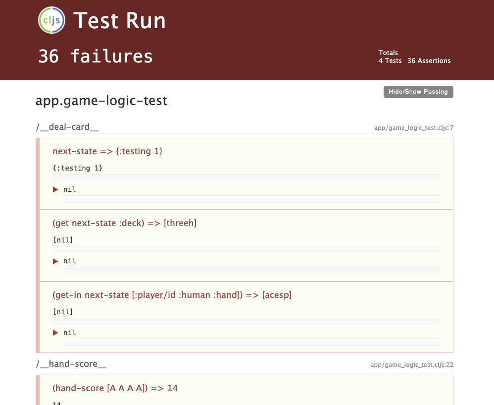
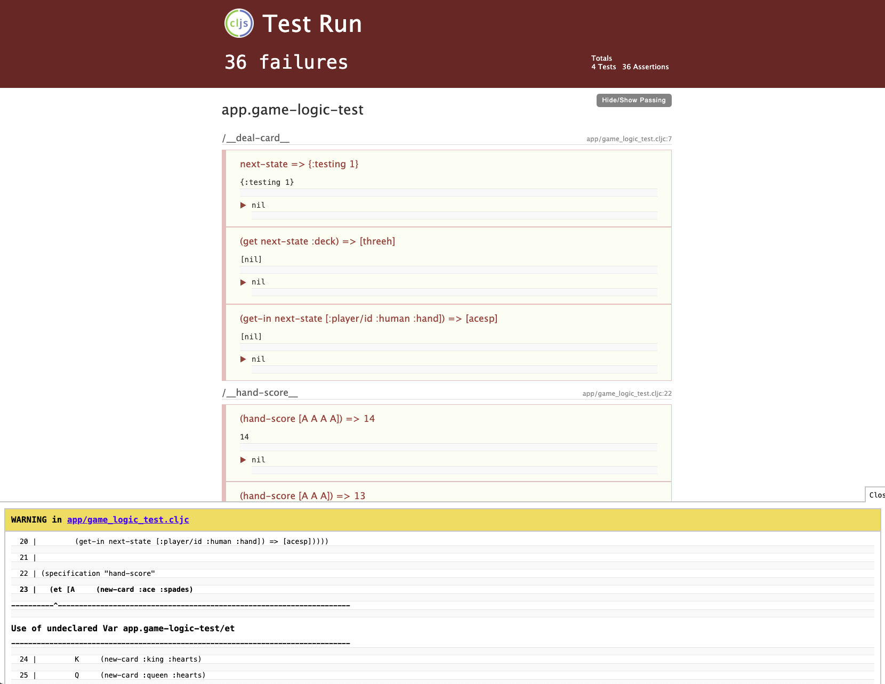

= Blackjack Project

In this project you'll be building the logic of a simple browser-based
game of blackjack. You will need:

* Clojure
* https://nodejs.org/en/download[Node]
* IntelliJ with the Cursive plugin

In stage one of this project you will be writing the core logic needed
to run the game.

In stage two you will be connecting that game logic to the UI, so that
the basics of the game work.

In stage three you will refine the UI to make it look nicer.

== Steps to Start the Project

[source,bash]
-----
npm install
npx shadow-cljs server
-----

The second command will list some URLs. Open a browser to the one
with port 9630: http://localhost:9630

This screen controls the compiler. You can stop/start builds for the
two Builds. One build is for the game itself (main), and the other
is for running tests that verify your logic.

Start both builds by clicking on:
* Builds
* Click the "Watch" button on each build. The small circle on each build will turn green when it finishes.
If it turns red, it means you've made a mistake in the code. Clicking on the name of the build will give more
details.

You should see something like this (once you press the Watch button on both builds):

This links at the bottom are how you get to your running tests or game. Click on the one with the number
8023 in it, and this will show you your test results. This is where you will be working for the first stages.
You should see a bunch of failing tests.

== Working

There are two kinds of mistakes you can make in programming: syntactical and logical. The compiler will catch and
report the first kind, but you must test your code in order to catch the second kind.

The tests at http://localhost:8023 will show the results of your running tests (if they pass/fail).

As you write the project code, you will look for that particular thing in this list of tests and
make sure that all of the tests for it are passing.

If you make a mistake in the syntax of the code that the compiler cannot understand, a warning will
expand from the bottom to explain what you did wrong. In the example below I've accidentally forgotten to type the letter
`l` in the word `let`. The compiler is telling me it doesn't know what `et` is. Note that it
will indicate the file and line that is causing the problem:

When you correct the mistake the warning box should automatically disappear.

== Data Representation and Design

The state of the game at any point in time is to be represented as a map with the following structure:

* The deck of cards is under the `:deck` key. This will initially hold a vector (shuffled) of all 52 cards.
* Each player will be represented as a map containing the key `:hand` whose value is a vector of the cards they have,
and `:show-all?` which is a boolean indicating if the UI should show all the cards, or just one.
* The two players will be stored under the path `[:player/id :human]` and `[:player/id :dealer]`. The human's hand
starts out showing, and the dealers is partially hidden (`:show-all? false`).
* We keep track of whose turn it is with a top-level `:active-player` key which will be the ID of the active player
* The game goes in just a few basic steps:
** We set up the initial game state (set up the deck and deal 2 cards each)
** Make it the human's turn
** When the human busts, game over
** If the human "stays", then it the dealer takes cards until it wins or busts.

For example, the initial game state (before dealing) would be:

[source]
-----
{:deck          [{:card/rank :ace :card/suit :spades} {:card/rank 6 :card/suit :clubs} ...]
 :active-player :human
 :player/id     {:dealer {:hand []
                          :show-all? false}
                 :human  {:hand []
                          :show-all? true}}}
-----

Dealing a card is:

* Read the first card from deck
* Put that card value onto a player's hand (at a path like [:player/id :dealer :hand])
* Rewrite deck so that the first card isn't there anymore

So, dealing one to human causes the new game state to be:

[source]
-----
{:deck          [{:card/rank 6 :card/suit :clubs} ...]
 :active-player :human
 :player/id     {:dealer {:hand []
                          :show-all? false}
                 :human  {:hand [{:card/rank :ace :card/suit :spades}]
                          :show-all? true}}}
-----

Similarly, calculating the current hand value for a player just involves:

* Get the vector of cards from a player (e.g. at path `[:player/id :human :hand]`)
* Detect if the hand has an ace
* Sum up the value of each card (counting aces as 1)
* If the hand has an ace, and adding 10 to it would not cause it to be bigger than 21, then add 10.

The game progresses through 3 basic steps:

1. Initialize and start human turn
2. Human choose hit/stay: bust is detected on hits, which goes to state 4 (game over)
3. Dealer takes cards until bust/win
4. Game over (show all cards for everyone and announce winner)

== List of Things You Will Likely Need

* ->
* assoc
* assoc-in
* butlast
* cond
* conj
* defn
* first
* for
* fn
* get
* get-in
* if
* let
* loop/recur
* mapv
* name
* number?
* reduce
* rest
* str
* swap!
* update

From Fulcro:

* defsc
* DOM generators (e.g. dom/div)
* ui factories
* defmutation
* transact!

